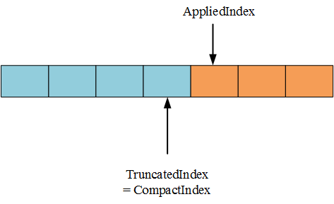

## Part B

[UML](./imgs/RaftKV.vsdx)

### 如何驱动Raft？
tinykv 的 Raft 复用自 etcd，采用逻辑时钟，需要由上层模块进行驱动。

[How to drive Raft?](./imgs/how_to_drive_raft.vsdx)

### Implement Raft ready process

#### `proposeRaftCommand()`的逻辑
`proposeRaftCommand()`的调用者有两个，分别是`peerMsgHandler`的`HandleMsg()`和`onRaftGCLogTick()`。先看`HandleMsg`：

```go
func (d *peerMsgHandler) HandleMsg(msg message.Msg) {
	switch msg.Type {
	...
	case message.MsgTypeRaftCmd:
		raftCMD := msg.Data.(*message.MsgRaftCmd)
		d.proposeRaftCommand(raftCMD.Request, raftCMD.Callback)
	...
}
```

`MsgTypeRaftCmd`类型的消息来自`RaftstoreRouter.SendRaftCommand`：
```go
func (r *RaftstoreRouter) SendRaftCommand(req *raft_cmdpb.RaftCmdRequest, cb *message.Callback) error {
	cmd := &message.MsgRaftCmd{
		Request:  req,
		Callback: cb,
	}
	regionID := req.Header.RegionId
	return r.router.send(regionID, message.NewPeerMsg(message.MsgTypeRaftCmd, regionID, cmd))
}
```

这个调用来自上层客户端。以测试代码中的 Put 操作为例，调用链为：
```
    (*Cluster).MustPutCF
             |
             V
    (*Cluster).Request
             |
             V
    (*Cluster).CallCommandOnLeader
             |
             V
    (*Cluster).CallCommand
             |
             V
    (*NodeSimulator).CallCommandOnStore
             |
             V
    (*RaftstoreRouter).SendRaftCommand
```

对于来自客户端的请求，处理思路是将其封装成 Raft 日志放进 Raft group 进行同步，当 Raft 把日志提交上来后就可以执行请求中的操作了（这是`HandleRaftReady`要实现的功能）。

```go
func (d *peerMsgHandler) proposeRaftCommand(msg *raft_cmdpb.RaftCmdRequest, cb *message.Callback) {
	err := d.preProposeRaftCommand(msg)
	if err != nil {
		cb.Done(ErrResp(err))
		return
	}
	// Your Code Here (2B).
	p := &proposal{
		index: d.nextProposalIndex(),
		term:  d.Term(),
		cb:    cb,
	}
	if msg.AdminRequest != nil {
		d.proposeAdminRequest(msg, p)
	} else {
		d.proposeData(msg, p)
	}
}
```

首先要构造一个`proposal`。`nextProposalIndex()`返回的是底层`Raftlog`的`LastIndex + 1`，也就是接下来要放进 Raft group 进行同步的最新一条日志的 index。`Callback`是与客户端沟通的桥梁：
```go
type Callback struct {
	Resp *raft_cmdpb.RaftCmdResponse
	Txn  *badger.Txn // used for GetSnap
	done chan struct{}
}
```
客户端发出请求后会在`done`上面阻塞等待，当我们把请求处理完毕后向调用`Callback.Done()`向`done`写入一个`struct{}{}`即可将结果通知给客户端。

构造好的`proposal` `p`会被保存到`proposals`里面。**`proposals`是`peer`的成员变量，在 tinykv 提供的代码中这是一个`[]*proposal`类型，我不知道 tinykv 为什么这么愚蠢，所以我把它改成了`map[uint64]*proposal`类型，key 就是`p.index`。如果用数组的话，查找的时候只能顺序查找。**

`proposeData()`追加的日志在 Raft group 中达成一致后会被提交上来，`HandleRaftReady()`通过`Ready()`获得 committed entries 后调用`process()`进行处理。我们需要根据不同的消息类型实现不同的处理逻辑。Get/Put/Delete/Snap 是以 CmdType 发送过来的，针对 KV 数据，调用`processRequest()`；CompactLog 等是通过 AdminCmdType 发送过来的，调用`processAdminRequest()`。处理完毕后调用`notify()`将结果通知给客户端。

```go
func (d *peerMsgHandler) notify(entry *eraftpb.Entry, fn func(p *proposal)) {
	p, ok := d.proposals[entry.Index]
	if !ok {
		return
	}
	if p.index != entry.Index {
		log.Warnf("no matched proposal found for entry [index = %d, term = %d]", entry.Index, entry.Term)
		return
	}

	if !d.IsLeader() {
		log.Warnf("%x is not a leader", d.PeerId())
		NotifyNotLeader(d.regionId, entry.Term, p.cb)
		d.proposals = make(map[uint64]*proposal)
		return
	}
	if p.term == entry.Term {
		fn(p)
	} else {
		log.Infof("%x proposal term not matched at index = %d [entry.term = %d, proposal.term = %d]",
			d.PeerId(), entry.Index, entry.Term, p.term)
		NotifyStaleReq(entry.Term, p.cb)
	}
	delete(d.proposals, p.index)
}
```
关于`notify()`的几点说明：

1. 客户端的请求是在 Leader 上发出的，但是这期间 Leader 可能会挂掉。如果调用`notify()`时`peer`不再是 Leader，那么就要给上层返回一个错误并清空`proposals`。上层如果发现 Leader 变更，就会继续尝试新的 Leader，参见`(*Cluster).CallCommandOnLeader`。
2. 如果在`proposals`中找到一个`proposal` `p`，`p.index == entry.Index`但是`p.term != entry.Term`，这说明之前调用`proposeData()`扔给 Raft 的那条日志被丢弃了，在相同 index 上面出现了一条 term 更大的日志。原因可能是以前那个 Leader 挂了，新的 Leader 用更新的日志把旧的日志覆盖了。同样地，我们要给上层返回一个错误。

文档里有这么一段说明：
> In this stage, you may consider these errors, and others will be processed in project3:
>
> - ErrNotLeader: the raft command is proposed on a follower. so use it to let the client > try other peers.
> - ErrStaleCommand: It may due to leader changes that some logs are not committed and overrided with new leaders’ logs. But the client doesn’t know that and is still waiting for the response. So you should return this to let the client knows and retries the command again.

`Cluster.Request()`：
```go
func (c *Cluster) Request(key []byte, reqs []*raft_cmdpb.Request, timeout time.Duration) (*raft_cmdpb.RaftCmdResponse, *badger.Txn) {
	startTime := time.Now()
	for i := 0; i < 10 || time.Now().Sub(startTime) < timeout; i++ {
		region := c.GetRegion(key)
		regionID := region.GetId()
		req := NewRequest(regionID, region.RegionEpoch, reqs)
		resp, txn := c.CallCommandOnLeader(&req, timeout)
		if resp == nil {
			// it should be timeouted innerly
			SleepMS(100)
			continue
		}
		if resp.Header.Error != nil {
			SleepMS(100)
			continue
		}
		return resp, txn
	}
	panic("request timeout")
}
```

可以看到这里并未严格区分错误类型，只要返回错误就会一直重试，直到超时。但为了规范性，`notify()`仍对错误类型进行了区分。

#### `HandleRaftReady()`的逻辑
在[如何驱动Raft？](#如何驱动Raft？)已经分析过了。

## Part C
### Log compaction
> Raftstore checks whether it needs to gc log from time to time based on the config RaftLogGcCountLimit, see onRaftGcLogTick(). If yes, it will propose a raft admin command CompactLogRequest which is wrapped in RaftCmdRequest just like four basic command types(Get/Put/Delete/Snap) implemented in project2 part B. Then you need to process this admin command when it’s committed by Raft. But unlike Get/Put/Delete/Snap commands write or read state machine data, CompactLogRequest modifies metadata, namely updates the RaftTruncatedState which is in the RaftApplyState. After that, you should schedule a task to raftlog-gc worker by ScheduleCompactLog. Raftlog-gc worker will do the actual log deletion work asynchronously.

tinykv 检查 raft 日志大小的方式是周期性检查，见`peerMsgHandler.onRaftGCLogTick()`：
```go
func (d *peerMsgHandler) onRaftGCLogTick() {
	d.ticker.schedule(PeerTickRaftLogGC)
	if !d.IsLeader() {
		return
	}

	appliedIdx := d.peerStorage.AppliedIndex()
	firstIdx, _ := d.peerStorage.FirstIndex()
	var compactIdx uint64
	if appliedIdx > firstIdx && appliedIdx-firstIdx >= d.ctx.cfg.RaftLogGcCountLimit {
		compactIdx = appliedIdx
	} else {
		return
	}

	y.Assert(compactIdx > 0)
	compactIdx -= 1
	if compactIdx < firstIdx {
		// In case compact_idx == first_idx before subtraction.
		return
	}

	term, err := d.RaftGroup.Raft.RaftLog.Term(compactIdx)
	if err != nil {
		log.Fatalf("appliedIdx: %d, firstIdx: %d, compactIdx: %d", appliedIdx, firstIdx, compactIdx)
		panic(err)
	}

	// Create a compact log request and notify directly.
	regionID := d.regionId
	request := newCompactLogRequest(regionID, d.Meta, compactIdx, term)
	d.proposeRaftCommand(request, nil)
}
```

Log compaction 请求由`proposeRaftCommand()`发出，在 Raft group 内达成一致后被提交上来，并由`processAdminRequest()`处理：
```go
func (d *peerMsgHandler) processAdminRequest(entry *eraftpb.Entry, msg *raft_cmdpb.RaftCmdRequest, kvWB *engine_util.WriteBatch) {
	switch msg.AdminRequest.CmdType {
	case raft_cmdpb.AdminCmdType_CompactLog:
		c := msg.AdminRequest.CompactLog
		if c.CompactIndex > d.peerStorage.truncatedIndex() {
			d.peerStorage.applyState.TruncatedState.Index = c.CompactIndex
			d.peerStorage.applyState.TruncatedState.Term = c.CompactTerm
			if err := kvWB.SetMeta(meta.ApplyStateKey(d.regionId), d.peerStorage.applyState); err != nil {
				panic(err)
			}
			d.ScheduleCompactLog(c.CompactIndex)
			resp := &raft_cmdpb.RaftCmdResponse{
				Header: &raft_cmdpb.RaftResponseHeader{CurrentTerm: d.Term()},
				AdminResponse: &raft_cmdpb.AdminResponse{
					CmdType:    raft_cmdpb.AdminCmdType_CompactLog,
					CompactLog: &raft_cmdpb.CompactLogResponse{},
				},
			}
			d.notify(entry, func(p *proposal) {
				p.cb.Done(resp)
			})
		}
	}
}
```

`ScheduleCompactLog()`会调度`runner.raftLogGCTaskHandler`执行日志删除动作。

至于 tinykv 希望我们实现的`RaftLog.maybeCompact()`则并未被调用过，不实现这个函数也可以通过 2C 的测试。

Log compaction 之后 FirstIndex 随之被修改：

```go
func (ps *PeerStorage) FirstIndex() (uint64, error) {
	return ps.truncatedIndex() + 1, nil
}
```

`FirstIndex`就是 Raft 论文里的`lastIncludedIndex`，该位置之前（不含）的日志都被丢弃了。

tinykv 的 log compaction 和 snapshot 是分离的，和 6.824 的实现不同。 6.824 在 log compaction 的同时装载 snapshot。

### Snapshot
#### snapshot的触发
snapshot的触发只在一个地方：
```go
func (r *Raft) sendAppend(to uint64) {
	// Your Code Here (2A).
	pr := r.Prs[to]
	m := pb.Message{}
	m.To = to

	term, errt := r.RaftLog.Term(pr.Next - 1)
	ents, erre := r.RaftLog.slice(pr.Next, r.RaftLog.LastIndex()+1)
	if errt != nil || erre != nil { // send snapshot if we failed to get term or entries
		m.MsgType = pb.MessageType_MsgSnapshot
		snapshot, err := r.RaftLog.snapshot()
		if err != nil {
			if err == ErrSnapshotTemporarilyUnavailable {
				log.Infof("%x failed to send snapshot to %x because snapshot is temporarily unavailable", r.id, to)
				return
			}
			panic(err)
		}
		if IsEmptySnap(&snapshot) {
			panic("need non-empty snapshot")
		}
		m.Snapshot = &snapshot
		sindex, sterm := snapshot.Metadata.Index, snapshot.Metadata.Term
		log.Infof("%x [firstindex: %d, commit: %d] sent snapshot[index: %d, term: %d] to %x [%v]",
			r.id, r.RaftLog.FirstIndex(), r.RaftLog.committed, sindex, sterm, to, pr)
	} else {
		m.MsgType = pb.MessageType_MsgAppend
		m.Index = pr.Next - 1 // prevLogIndex
		m.LogTerm = term      // prevLogTerm
		m.Entries = ref(ents)
		m.Commit = r.RaftLog.committed // leaderCommit
	}
	r.send(m)
}

func (l *RaftLog) slice(lo, hi uint64) ([]pb.Entry, error) {
	err := l.mustCheckOutOfBounds(lo, hi)
	......
}

func (l *RaftLog) mustCheckOutOfBounds(lo, hi uint64) error {
	......
	fi := l.FirstIndex()
	if lo < fi {
		return ErrCompacted
	}
	......
}
```

这和 6.824 的实现逻辑是一样的，即`nextIndex[i] < lastIncludedIndex`时发送 InstallSnapshot RPC，否则发送 AppendEntries RPC。

#### `PeerStorage`生成的 snapshot 的内容是什么？
找到`PeerStorage.Snapshot()`：
```go
func (ps *PeerStorage) Snapshot() (eraftpb.Snapshot, error) {
	var snapshot eraftpb.Snapshot
	if ps.snapState.StateType == snap.SnapState_Generating {
		select {
		case s := <-ps.snapState.Receiver:
			if s != nil {
				snapshot = *s
			}
		default:
			return snapshot, raft.ErrSnapshotTemporarilyUnavailable
		}
		ps.snapState.StateType = snap.SnapState_Relax
		if snapshot.GetMetadata() != nil {
			ps.snapTriedCnt = 0
			if ps.validateSnap(&snapshot) {
				return snapshot, nil
			}
		} else {
			log.Warnf("%s failed to try generating snapshot, times: %d", ps.Tag, ps.snapTriedCnt)
		}
	}

	if ps.snapTriedCnt >= 5 {
		err := errors.Errorf("failed to get snapshot after %d times", ps.snapTriedCnt)
		ps.snapTriedCnt = 0
		return snapshot, err
	}

	log.Infof("%s requesting snapshot", ps.Tag)
	ps.snapTriedCnt++
	ch := make(chan *eraftpb.Snapshot, 1)
	ps.snapState = snap.SnapState{
		StateType: snap.SnapState_Generating,
		Receiver:  ch,
	}
	// schedule snapshot generate task
	ps.regionSched <- &runner.RegionTaskGen{
		RegionId: ps.region.GetId(),
		Notifier: ch,
	}
	return snapshot, raft.ErrSnapshotTemporarilyUnavailable
}
```

第一次调用该函数的时候由于尚未处在“Generating”状态，所以返回错误。snapshot 是从`snapState.Receiver`接收的，而这个 channel 的写端是末尾那个`Notifier`。在 Goland 里“右键->Find Usages”定位到`runner`包下面的`region_task.go`：
```go
func (snapCtx *snapContext) handleGen(regionId uint64, notifier chan<- *eraftpb.Snapshot) {
	snap, err := doSnapshot(snapCtx.engines, snapCtx.mgr, regionId)
	if err != nil {
		log.Errorf("failed to generate snapshot!!!, [regionId: %d, err : %v]", regionId, err)
		notifier <- nil
	} else {
		notifier <- snap
	}
}

func doSnapshot(engines *engine_util.Engines, mgr *snap.SnapManager, regionId uint64) (*eraftpb.Snapshot, error) {
	log.Debugf("begin to generate a snapshot. [regionId: %d]", regionId)

	txn := engines.Kv.NewTransaction(false)

	index, term, err := getAppliedIdxTermForSnapshot(engines.Raft, txn, regionId)
	if err != nil {
		return nil, err
	}
	......
}

func getAppliedIdxTermForSnapshot(raft *badger.DB, kv *badger.Txn, regionId uint64) (uint64, uint64, error) {
	applyState := new(rspb.RaftApplyState)
	err := engine_util.GetMetaFromTxn(kv, meta.ApplyStateKey(regionId), applyState)
	if err != nil {
		return 0, 0, err
	}

	idx := applyState.AppliedIndex
	var term uint64
	if idx == applyState.TruncatedState.Index {
		term = applyState.TruncatedState.Term
	} else {
		entry, err := meta.GetRaftEntry(raft, regionId, idx)
		if err != nil {
			return 0, 0, err
		} else {
			term = entry.GetTerm()
		}
	}
	return idx, term, nil
}
```

之前在`processAdminRequest()`里面把`applyState`保存到 badger，现将其读取出来。显然，`Snapshot.Metadata.Index`和`Snapshot.Metadata.Term`就是`AppliedIndex`及其对应的 term。



把 snapshot 应用到 RaftLog：
```go
func (l *RaftLog) restore(s *pb.Snapshot) {
	log.Infof("log [%s] starts to restore snapshot [index: %d, term: %d]", l, s.Metadata.Index, s.Metadata.Term)
	l.committed = s.Metadata.Index
	l.offset = s.Metadata.Index + 1
	l.pendingSnapshot = s
}
```

`s.Metadata.Index`就是`AppliedIndex`，该位置上的日志必然是“已提交”的，并且已经被持久化了（见`PeerStorage.Append()`）；`offset`指向的是第一条不可靠（即未持久化）的日志，所以`offset`设置成`s.Metadata.Index + 1`。

`RaftLog.FirstIndex()`逻辑：
```go
func (l *RaftLog) FirstIndex() uint64 {
	if l.pendingSnapshot != nil {
		return l.pendingSnapshot.Metadata.Index + 1
	}
	i, err := l.storage.FirstIndex()
	if err != nil {
		panic(err)
	}
	return i
}
```

这是参考 etcd 的实现：
```go
func (l *raftLog) firstIndex() uint64 {
	if i, ok := l.unstable.maybeFirstIndex(); ok {
		return i
	}
	index, err := l.storage.FirstIndex()
	if err != nil {
		panic(err) // TODO(bdarnell)
	}
	return index
}

func (u *unstable) maybeFirstIndex() (uint64, bool) {
	if u.snapshot != nil {
		return u.snapshot.Metadata.Index + 1, true
	}
	return 0, false
}
```

`l.pendingSnapshot.Metadata.Index + 1`等于`l.offset`，也就是第一个 unstable entry 的索引。为什么要这样做？如果`RaftLog`没有装载 snapshot，显然`FirstIndex`应是第一个 stable entry 的索引，因为 stable entries 更靠前，后面跟着的是 unstable entries；如果装载了 snapshot，由于`Snapshot.Metadata.Index`就是`AppliedIndex`，根据前面对 log compaction 的分析可知，`AppliedIndex`之前的 entries 会被丢弃掉，所以剩下的第一条日志就是`AppliedIndex`对应的那条。**由于第一条日志是一个 dummy entry，所以真正的“第一条”日志的索引还要再+1**。

`RaftLog.LastIndex()`的逻辑也是参考 etcd 实现的：
```go
func (l *RaftLog) LastIndex() uint64 {
	// Your Code Here (2A).
	if n := uint64(len(l.entries)); n > 0 {
		return l.offset + n - 1
	}
	if l.pendingSnapshot != nil {
		return l.pendingSnapshot.Metadata.Index
	}
	i, err := l.storage.LastIndex()
	if err != nil {
		panic(err)
	}
	return i
}
```

etcd：
```go
func (l *raftLog) lastIndex() uint64 {
	if i, ok := l.unstable.maybeLastIndex(); ok {
		return i
	}
	i, err := l.storage.LastIndex()
	if err != nil {
		panic(err) // TODO(bdarnell)
	}
	return i
}

func (u *unstable) maybeLastIndex() (uint64, bool) {
	if l := len(u.entries); l != 0 {
		return u.offset + uint64(l) - 1, true
	}
	if u.snapshot != nil {
		return u.snapshot.Metadata.Index, true
	}
	return 0, false
}
```

### 线性一致性测试
2B、2C 缺少线性一致性测试，故参照 MIT6.824 进行补充：
```go
func TestPersistPartitionUnreliableLinearizable12B(t *testing.T) {
	// Test: unreliable net, restarts, partitions, linearizability checks (2B) ...
	GenericTestLinearizability1(t, "2B", 15, 7, true, true, true, -1, false, false)
}

func TestPersistPartitionUnreliableLinearizable22B(t *testing.T) {
	// Test: unreliable net, restarts, partitions, linearizability checks (2B) ...
	GenericTestLinearizability2(t, "2B", 15, 7, true, true, true, -1, false, false)
}

func TestSnapshotUnreliableRecoverConcurrentPartitionLinearizable12C(t *testing.T) {
	// Test: unreliable net, restarts, partitions, snapshots, linearizability checks (2C) ...
	GenericTestLinearizability1(t, "2C", 15, 7, true, true, true, 100, false, false)
}

func TestSnapshotUnreliableRecoverConcurrentPartitionLinearizable22C(t *testing.T) {
	// Test: unreliable net, restarts, partitions, snapshots, linearizability checks (2C) ...
	GenericTestLinearizability2(t, "2C", 15, 7, true, true, true, 100, false, false)
}
```

这两种测试的区别在于`GenericTestLinearizability2`是通过`Scan`来实现`Get`的功能，也就是发送`Snap`请求获取数据快照，截取上一个 key 对应的 value；`GenericTestLinearizability1`则是直接发送`Get`请求。